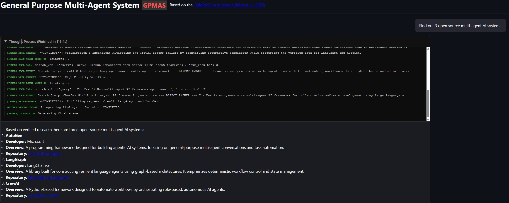

# COMPASS: Context-Organized Multi-Agent Planning and Strategy System


[](https://arxiv.org/abs/2510.08790)



**COMPASS** is a lightweight, hierarchical multi-agent framework designed to enhance long-horizon reasoning in Large Language Model (LLM) agents. Based on the Google Research paper **"COMPASS: Enhancing Agent Long-Horizon Reasoning with Evolving Context" (Wan et al., 2025)**, this system addresses the challenges of context management and distraction in complex, multi-step tasks.

## 🧭 Overview

Traditional LLM agents often struggle with long-term tasks because their context windows become cluttered with irrelevant execution history, leading to a loss of focus. COMPASS solves this by separating tactical execution from strategic oversight and context organization.

### Core Architecture

The system consists of three specialized agents working in tandem:

1.  **Main Agent (Tactical Executor)**:
    *   Responsible for immediate reasoning and tool interaction.
    *   Operates within a focused "Context Brief" provided by the Context Manager.
    *   Executes actions (e.g., searching, browsing) to gather evidence.

2.  **Meta-Thinker (Strategic Strategist)**:
    *   Monitors the Main Agent's execution trajectory.
    *   Decides whether to **CONTINUE**, **INTERRUPT** (for redirection), or mark the task as **COMPLETED**.
    *   Provides high-level "Strategic Signals" to guide the next phase of work.

3.  **Context Manager (Memory & Synthesizer)**:
    *   Maintains "Research Notes" – a persistent, evolving summary of verified evidence.
    *   Synthesizes a concise "Context Brief" for the Main Agent, incorporating strategic signals from the Meta-Thinker.
    *   Ensures the Main Agent always has the most relevant information without the noise of full history.

## ✨ Key Features

-   **Hierarchical Reasoning**: Separates high-level planning from low-level execution.
-   **Evolving Context**: Dynamically updates research notes to prevent context saturation.
-   **MCP Integration**: Full support for the **Model Context Protocol (MCP)**, allowing the agent to dynamically discover and use external tools (Google Search, DuckDuckGo, Tavily, etc.).
-   **Dual Interface**:
    *   **Streamlit UI**: A clean, data-science-friendly interface for rapid testing.
    *   **Modern Web Dashboard**: A premium, responsive FastAPI-powered web interface with real-time SSE (Server-Sent Events) streaming.
-   **Persistent History**: Full chat history and agent notes stored in SQLite.

## 🚀 Getting Started

### Prerequisites

-   Python 3.10+
-   An OpenAI-compatible API key (e.g., OpenRouter, OpenAI, or a local provider).
-   MCP Servers running (for tool use).

### Installation

1.  **Clone the repository**:
    ```bash
    git clone https://github.com/MilesQLi/COMPASS-Implementation
    cd COMPASS
    ```

2.  **Install dependencies**:
    ```bash
    conda create -n compass python=3.10
    conda activate compass
    pip install -r requirements.txt
    ```

3.  **Configure Environment Variables**:
    The system requires the following environment variables. You can set them in a `.env` file in the root directory or export them directly to your shell:

    | Variable | Description |
    | :--- | :--- |
    | `OpenRouterAPIKey` | Your OpenRouter or OpenAI API Key |
    | `TAVILY_API_KEY` | API Key for Tavily Search (required for search tools) |
    | `OPENAI_BASE_URL` | (Optional) Defaults to `https://openrouter.ai/api/v1` |

    **Example `.env` file:**
    ```env
    OpenRouterAPIKey=your_api_key_here
    TAVILY_API_KEY=your_tavily_api_key_here
    OPENAI_BASE_URL=https://openrouter.ai/api/v1
    ```

### Running the System

#### 1. Start MCP Tool Servers
You need to run at least one MCP server to enable tool use (e.g., Tavily or Google Search).
```bash
# Run the Tavily MCP server
run_tavily_mcp.bat
```

#### 2. Launch the UI
You can choose between the two interfaces:

-   **Full Web Version** (Premium Dashboard):
    ```bash
    run_server.bat
    ```
    The server starts on port `8501`. Access it at `http://localhost:8501`.

### ⚙️ Configuration

-   **Models**: You can change the model used by the agents by editing the `MODEL_NAME` variable in `main.py` or `server.py`. The system works best with reasoning models like `grok-4.1-fast`, `deepseek-v3`, or `glm-4.6v`.
-   **Ports**: 
    -   MCP Server: `8000`
    -   Web/Streamlit UI: `8501`

## 📂 Project Structure

-   `server.py`: FastAPI backend implementing the COMPASS logic with SSE streaming for the web UI.
-   `static/`: Frontend assets (HTML, CSS, JS) for the premium web dashboard.
-   `mcp_*.py`: Various MCP server implementations providing tools like search and extraction.
-   `chat_history.db`: SQLite database for persistent storage.
-   `logs/`: Detailed trace logs for each agent session.

## 📚 References

-   **Paper**: [COMPASS: Enhancing Agent Long-Horizon Reasoning with Evolving Context](https://arxiv.org/abs/2510.08790) (Wan et al., 2025).
-   **Architecture**: Context-Organized Multi-Agent Planning and Strategy System.


## Disclaimer

This software is provided "as is", without warranty of any kind, express or implied, including but not limited to the warranties of merchantability, fitness for a particular purpose and noninfringement. In no event shall the authors or copyright holders be liable for any claim, damages or other liability, whether in an action of contract, tort or otherwise, arising from, out of or in connection with the software or the use or other dealings in the software.

Users are responsible for checking and validating the correctness of their configuration files, safetensor files, and binary files generated using the software. The developers assume no responsibility for any errors, omissions, or other issues coming in these files, or any consequences resulting from the use of these files.


## ⚖️ License
This project is licensed under the MIT License - see the [LICENSE](LICENSE) file for details.

---
*Built with ❤️ based on Google's COMPASS research.*
